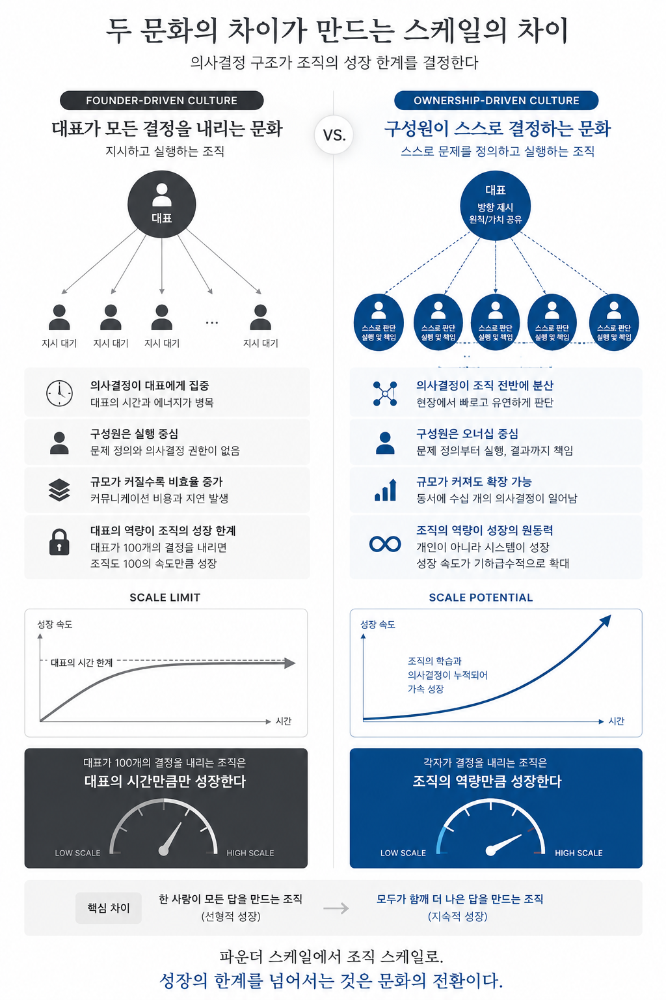

# Founder to Organization Scale

> A research-backed operating manual for moving from founder-centered execution to organization-level decision-making in the AI Agent era.

Early startups often win because a founder can make fast, coherent decisions across product, hiring, sales, and operations. That same strength becomes a bottleneck when the company grows: too many decisions, too much context trapped at the top, and too much work waiting behind one person's calendar.



This repository documents a practical transition:

```text
Founder scale      = one person makes most of the answers
Organization scale = many people make better answers inside clear guardrails
AI-agent scale     = humans set intent, agents prepare/execute bounded work, governance becomes infrastructure
```

## Core thesis

Companies do not scale by making the founder faster. They scale by moving more sound decisions closer to the people and systems with the best local information, while preserving coherence through explicit principles, decision rights, metrics, and review mechanisms.

In the AI Agent era, the constraint changes again. Agents can decentralize decision preparation by gathering context, drafting proposals, routing work, and executing reversible tasks. But they also recentralize governance into policy, permissions, evals, observability, and human approval thresholds.

## Why this repo exists

This is not a generic culture manifesto. It is meant to be an operator's kit.

Use it to:

- explain the scaling limit of founder-driven culture;
- design an ownership-driven operating model;
- introduce DRI, DACI, RACI-lite, and RAPID only where they help;
- measure whether decision-making is actually moving out of the founder queue;
- define safe AI-agent delegation patterns for startups and scale-ups;
- create reusable decision records, delegation contracts, and agent-risk reviews.

## Repository map

```text
founder-to-organization-scale/
├── README.md
├── docs/
│   ├── executive-summary.md
│   ├── problem-statement.md
│   ├── founder-vs-ownership-driven.md
│   ├── case-studies/
│   ├── frameworks/
│   └── ai-agents/
├── templates/
├── diagrams/
├── assets/
└── bibliography.md
```

## Start here

1. Read [Executive Summary](docs/executive-summary.md).
2. Compare [Founder-Driven vs Ownership-Driven](docs/founder-vs-ownership-driven.md).
3. Apply the [Decision Rights Matrix](docs/frameworks/decision-rights-matrix.md).
4. Run the [Quarterly Decision Review](templates/quarterly-decision-review.md).
5. For AI workflows, use the [AI Agent Risk Review](templates/ai-agent-risk-review.md).

## Main visual



## One-line version

> A founder-driven company grows at the speed of one person's decisions. An ownership-driven company grows at the speed of a system that helps many people make good decisions.

## Source base

The repository synthesizes organization theory, startup operating literature, public operating manuals from GitLab / HubSpot / Atlassian / Intercom, and current AI-agent governance sources from OpenAI, Anthropic, Microsoft, NIST, OWASP, and MCP.

See [Bibliography](bibliography.md) for the primary sources.
