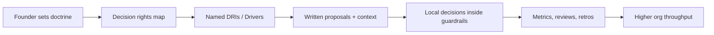

# Executive Summary

The hard limit in founder-driven scaling is usually not founder intelligence or commitment. It is serial decision-processing: too many important choices, too much context trapped at the top, and too much execution waiting behind one person's calendar.

Foundational organization research argues that decision rights should sit close to decision-relevant knowledge ([Jensen & Meckling](https://www.hbs.edu/faculty/Pages/item.aspx?num=442)). Empirical work also links greater decentralization to larger firm size and higher productivity, especially when local information matters more ([Bloom, Sadun & Van Reenen](https://worldmanagementsurvey.org/wp-content/images/2014/11/QJE-2012-Bloom-1663-705.pdf)). Startup research shows that venture-backed startups tend to professionalize earlier by adding formal people systems, specialized leaders, and operating processes ([Hellmann & Puri](https://onlinelibrary.wiley.com/doi/10.1111/1540-6261.00419)).

The most credible modern startup operating models converge on one pattern:

> Push decisions down, but make context, roles, and accountability more explicit.

GitLab formalizes this through DRIs, two-phase decision-making, and TeamOps. HubSpot combines autonomy and transparency with DRI-led quarterly execution. Atlassian institutionalizes DACI and Health Monitor practices. Intercom describes the shift from top-down roadmaps and "everyone does everything" to team-level ownership and Areas of Responsibility.

The shared lesson is not "less management." It is better-specified management.

AI agents accelerate this transition, but they do not remove the need for organizational design. Agents can compress decision-preparation time by planning, gathering inputs, routing work, drafting proposals, and taking bounded actions through tools. At the same time, they shift risk into new places: prompt injection, private data leakage, insecure tool use, weak authorization, poor observability, and over-delegation.

The emerging winning pattern is a policy-constrained organization:

- humans set intent, principles, approval thresholds, and quality bars;
- teams own decisions inside guardrails;
- agents prepare, synthesize, route, and execute bounded reversible work;
- governance, permissions, evals, and observability become operating infrastructure.

## Operating flow



*(Diagram source: [diagrams/org-decision-flow.mmd](../diagrams/org-decision-flow.mmd))*

## Practical implication

A startup does not become ownership-driven by telling people to "act like owners." It becomes ownership-driven when decision rights, communication rules, escalation triggers, and metrics are explicit enough that ownership is safe to exercise.

## Mental model

```text
Founder-driven throughput  ≈ founder decision bandwidth
Ownership-driven throughput ≈ sum of team decision bandwidths within guardrails
Agent-augmented throughput  ≈ human judgment × agent leverage × governance quality
```

These are not measured equations. They are operating heuristics.

## Repo output

This repo includes:

- case studies;
- decision-rights frameworks;
- DRI / DACI / RACI / RAPID comparison;
- onboarding and delegation rituals;
- scale KPIs;
- AI-agent drift analysis;
- AI-agent governance and failure-mode guides;
- reusable markdown templates;
- Mermaid diagrams and poster-style assets.
