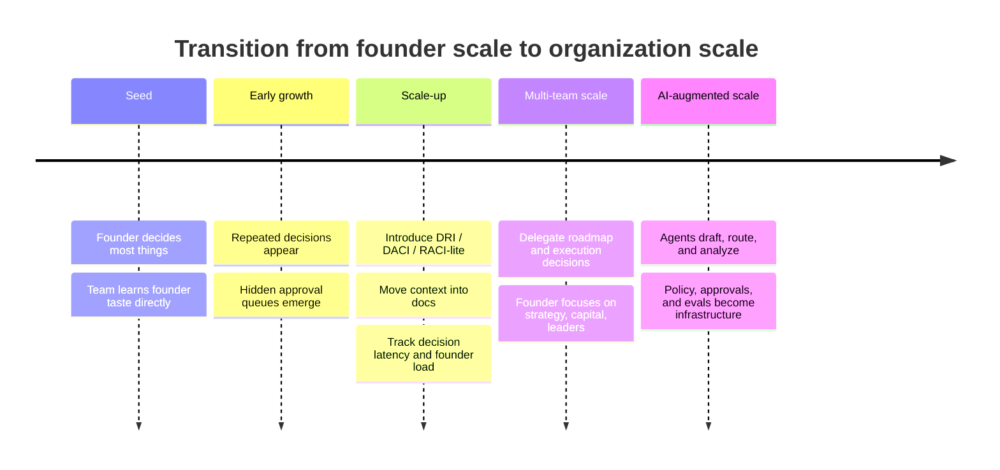

# Problem Statement

Early-stage startups often run on founder judgment. This is normal and often useful. The founder has the most context, the tightest product intuition, the strongest sense of urgency, and the clearest understanding of the company's existential constraints.

But the same model starts breaking when the number of important decisions grows faster than the founder's ability to process them.

## Symptoms of founder-scale limits

- Every meaningful decision waits for founder input.
- Meetings become a hidden approval queue.
- Managers spend more time coordinating upward than deciding locally.
- Teams avoid ownership because the founder may override the answer anyway.
- Context remains oral, implicit, and personality-dependent.
- Good people become executors instead of problem owners.
- Product, engineering, sales, and operations move at the speed of one calendar.

## The deeper issue

The issue is not simply centralization. Some decisions should remain centralized: mission, values, capital allocation, executive hiring, legal exposure, existential product bets, and crisis response.

The real issue is **undifferentiated centralization**: the founder becomes the default approver for both high-leverage irreversible decisions and low-level reversible decisions.

That creates three compounding costs:

1. **Decision latency**: work waits behind one person.
2. **Context compression**: local knowledge must be translated upward before action.
3. **Ownership erosion**: people learn that the safest move is to ask, not decide.

## Target state

The target state is not a flat organization.

The target state is a distributed decision system with:

- explicit decision rights;
- named owners;
- written context;
- clear escalation rules;
- measurable outcomes;
- structured disagreement;
- founder involvement only where it compounds.

In the AI Agent era, the target state also requires:

- agent permissions;
- human approval thresholds;
- evals and observability;
- secure tool use;
- data-class boundaries;
- incident and audit trails.

## How the transition typically unfolds

*(Diagram source: [diagrams/transition-timeline.mmd](../diagrams/transition-timeline.mmd). For the quarter-by-quarter mechanics, see [The First 90 Days](frameworks/first-90-days.md); for what to adopt at each company size, see [What to Adopt at Each Stage](frameworks/stage-guide.md).)*
